# ELKB

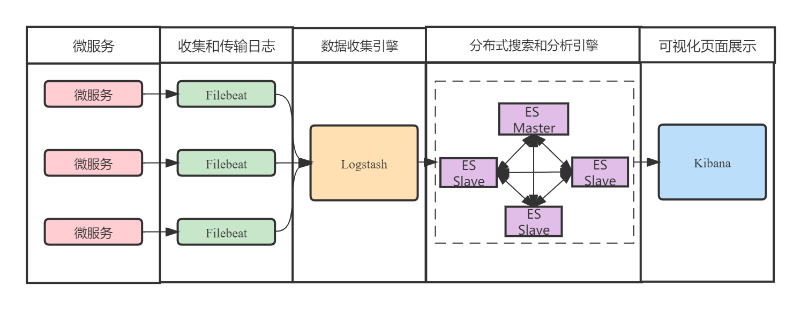

ELKB中各组件的作用如下：

- Filebeat：采集日志文件等数据；
- Logstash：处理过滤日志数据；
- Elasticsearch：存储、索引日志；
- Kibana：可视化界面；

```
docker run -d \
  --name elasticsearch \
  --restart always \
  -p 9200:9200 \
  -p 9300:9300  \
  -e "ES_JAVA_OPTS=-Xms256m -Xmx256m" \
  -e "discovery.type=single-node" \
elasticsearch:6.7.0


docker run -d \
  --name kibana \
  --restart always \
  -p 5601:5601 \
  -v /opt/kibana/config/kibana.yml:/usr/share/kibana/config/kibana.yml \
kibana:6.7.0


docker run -d \
  --name logstash \
  --restart always \
  -p 4560:4560 \
  -p 5044:5044 \
  -v /opt/logstash/pipeline/logstash.conf:/usr/share/logstash/pipeline/logstash.conf \
logstash:6.7.0


docker run -d \
  --name filebeat \
  --restart=always \
  -v /opt/filebeat/config/filebeat.yml:/usr/share/filebeat/filebeat.yml \
  -v /opt/mall-leanring/mall_tiny_elk/nohup.out:/usr/share/filebeat/logs/mall_tiny_elk.log \
elastic/filebeat:6.7.0
```

filebeat.yml

```yml
filebeat.inputs:
  - type: log
    enabled: true
    paths:
      - /usr/share/filebeat/logs/mall_tiny_elk.log
    multiline:
      # 定义行首匹配规则，例如以日期开头的行是新日志的开始
      pattern: '^\d{4}'
      # 设置为 true 表示不匹配行属于前一行
      negate: true
      # 指定合并方向，"previous" 表示将匹配行追加到前一行
      match: "after"
      timeout: 5s
      
output.logstash:
  hosts: ["192.168.31.253:5044"]
```

grok debugger

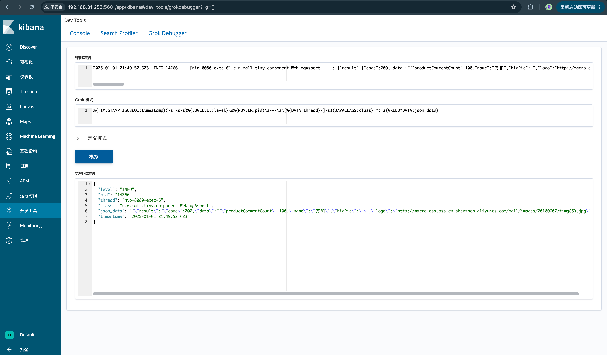

logstash.yml

```yml
input {
  beats {
    port => 5044
  }
}

filter {
  # 使用 grok 提取基础字段
  grok {
    match => { "message" => "%{TIMESTAMP_ISO8601:timestamp}(\s|\s\s)%{LOGLEVEL:level}\s%{NUMBER:pid}\s---\s\[%{DATA:thread}\]\s%{JAVACLASS:class} *: %{GREEDYDATA:json_data}" }
  }
}

output {
  elasticsearch {
    hosts => ["http://192.168.31.253:9200"]
    index => "logs-%{+yyyy.MM.dd}"
  }
  stdout { codec => rubydebug }
}

```

kibana.yml

```yml
server.name: kibana
server.host: "0"
elasticsearch.hosts: [ "http://192.168.31.253:9200" ]
xpack.monitoring.ui.container.elasticsearch.enabled: true
# 设置kibana中文显示
i18n.locale: zh-CN
```

多行日志收集与字段提取(filebeat完成日志收集，logstash完成字段提取)


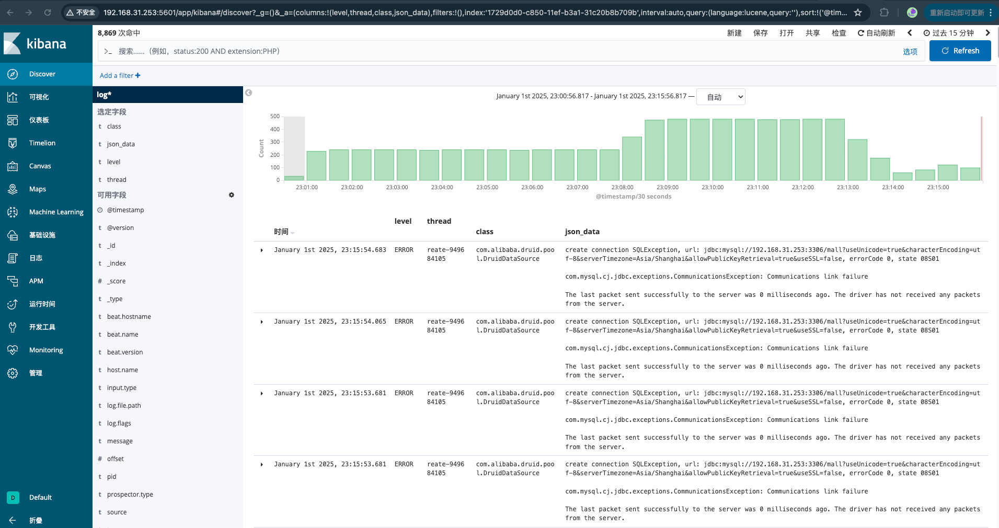

# 参考文档

- Filebeat官方文档  https://www.elastic.co/guide/en/beats/filebeat/6.7/filebeat-input-tcp.html
- logstash官方文档  https://www.elastic.co/guide/en/logstash/6.7/advanced-pipeline.html
- Logstash 收集跨多行格式日志  https://blog.csdn.net/supahero/article/details/111053755
- logstash处理多行日志-处理java堆栈日志  https://blog.csdn.net/fu_huo_1993/article/details/116655566
- SpringBoot 整合 Elastic Stack 最新版本(7.14.1)分布式日志解决方案，开源微服务全栈项目【有来商城】的日志落地实践  https://www.cnblogs.com/haoxianrui/p/15336249.html
- m1基于docker的springboot服务+ELK+filebeat日志系统搭建  https://juejin.cn/post/7150321242619248653
- docker-compose搭建ELK+filebeat（7.6.2）读取springboot项目日志  https://blog.csdn.net/m0_68705273/article/details/132071550
- ELK+Filebeat采集SpringBoot日志  https://juejin.cn/post/6993934038352265224
- Springboot + docker + ELK +Filebeat实现日志收集与展示  https://blog.csdn.net/hansome_hong/article/details/124704141
- Elasticsearch安装  https://www.kuangstudy.com/m/bbs/1674603266094575618
- Logstash：如何使用 Logstash Grok 过滤器提取模式  https://blog.csdn.net/UbuntuTouch/article/details/107512971
- SpringBoot应用整合ELK实现日志收集  https://blog.csdn.net/qq_41345773/article/details/112127596

# SLS


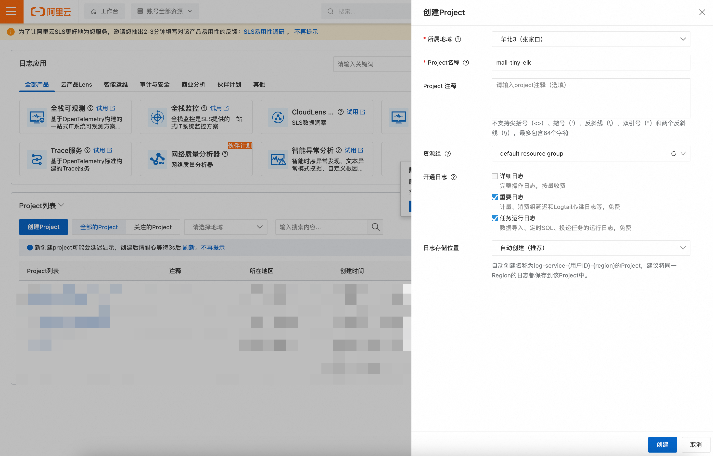


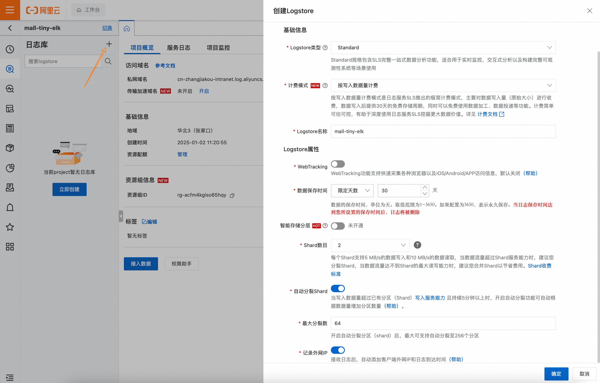


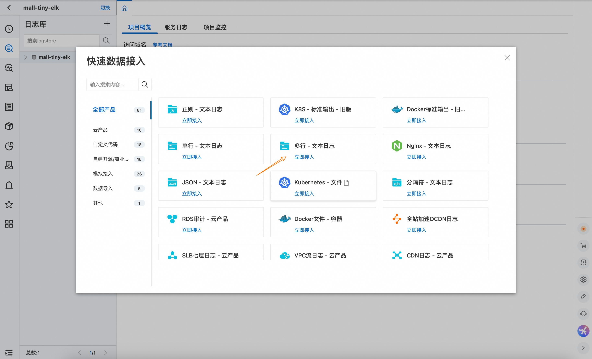


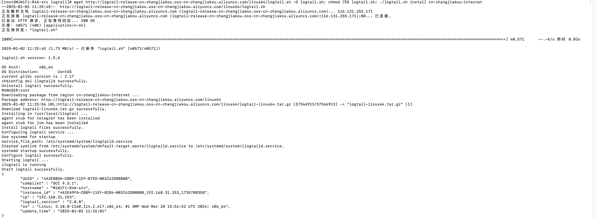

机器组标识IP地址填写上面的ip地址

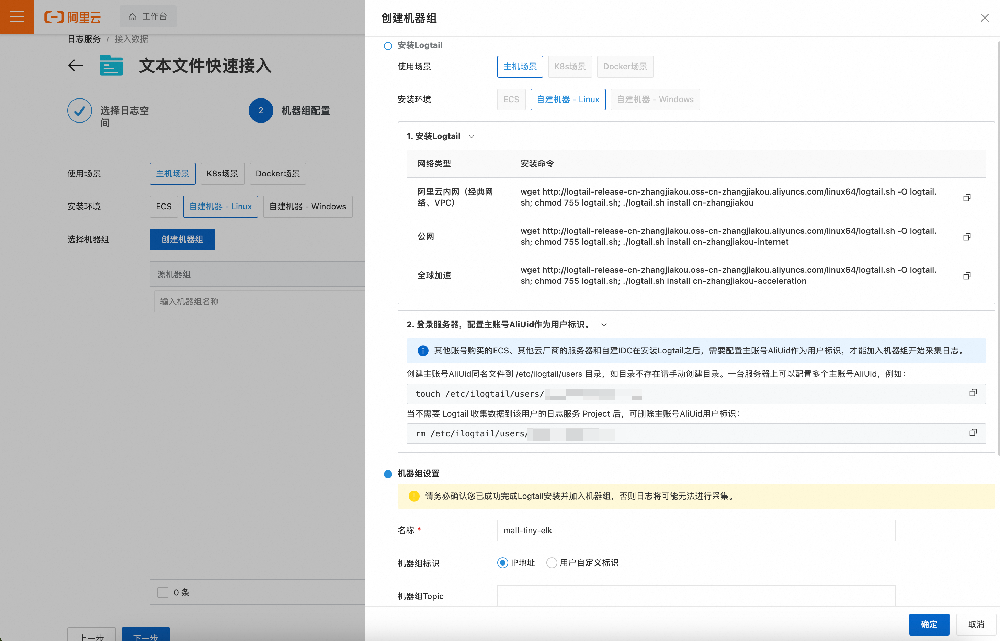


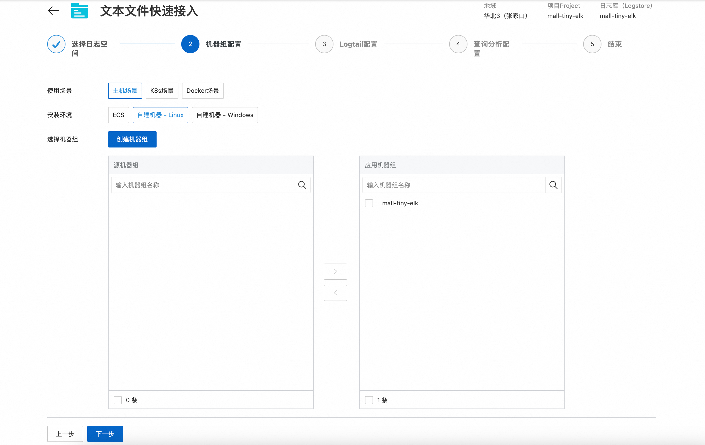

下面是重点，详细说明

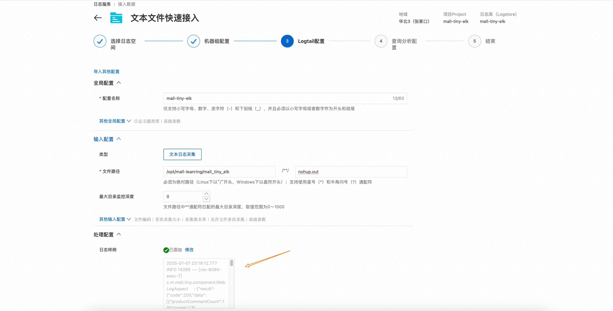

https://regex101.com

行首正则

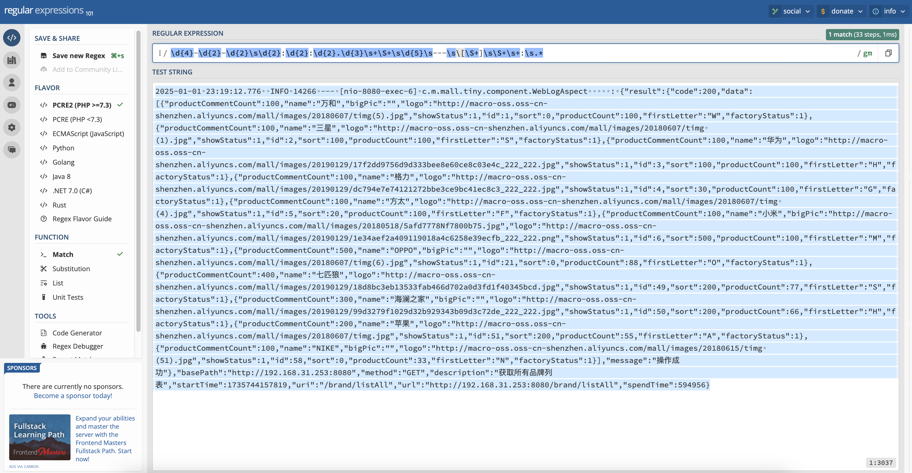

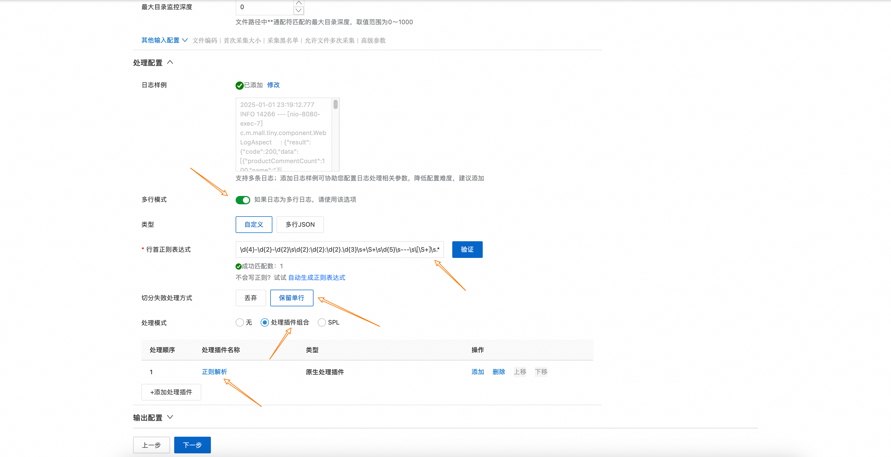

正则提取

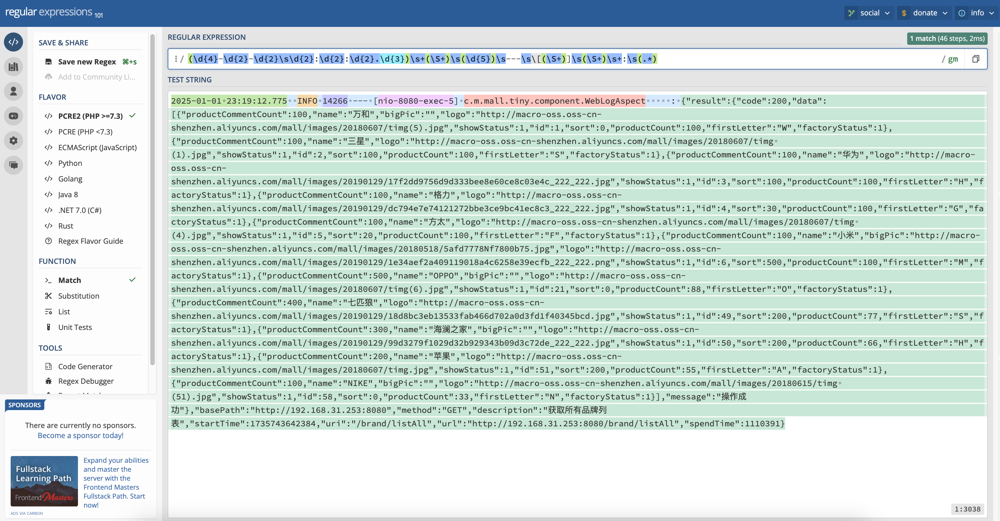


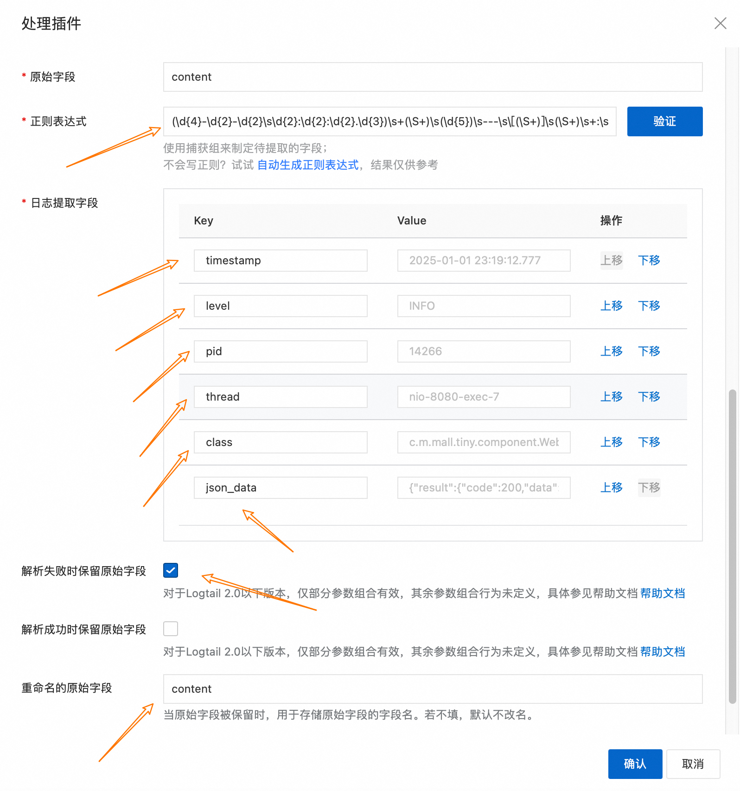


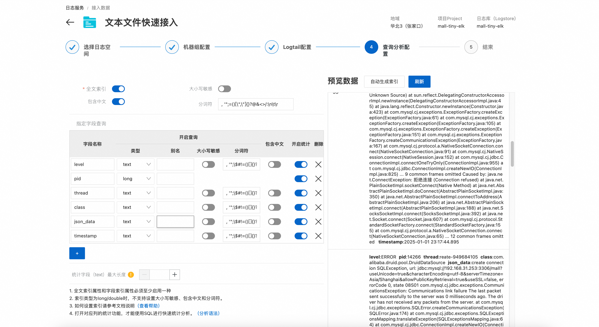

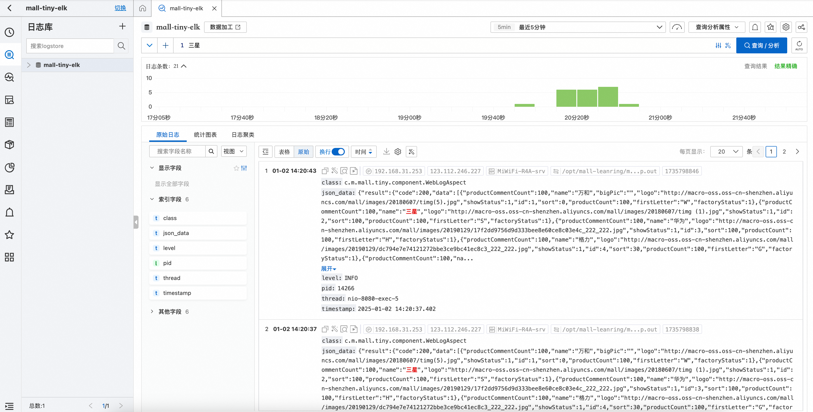
